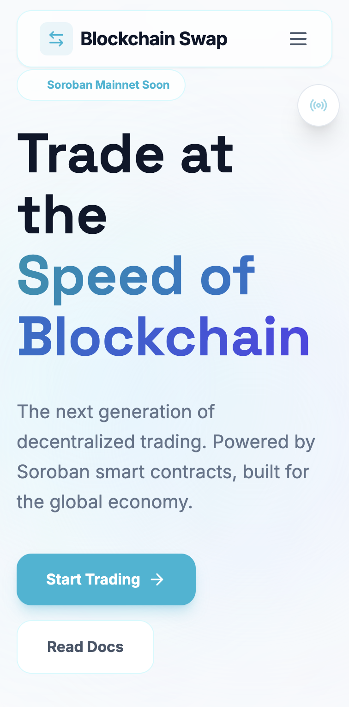
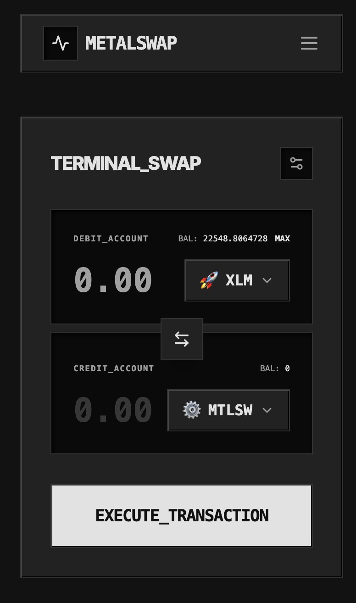
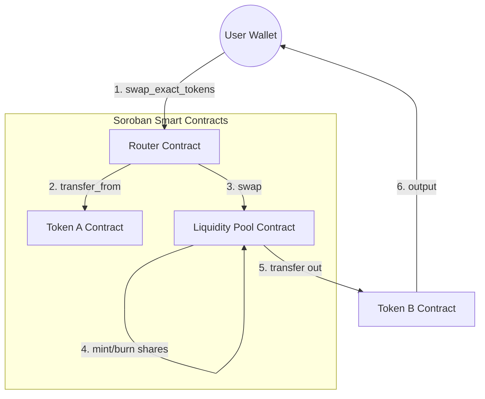

# 🧪 Metal-Swap



<div align="center">
  <p><strong>Trade at the Speed of Blockchain. Atomic. Transparent. Interconnected.</strong></p>
  
  [](https://github.com/Garvitk06/blockchain-swap/actions/workflows/ci.yml)
  [](https://blockchain-swap-frontend.vercel.app/)
  [](https://opensource.org/licenses/MIT)
  [](https://developers.stellar.org/docs/fundamentals-and-concepts/network-passphrases)
</div>

---

### 🚀 [Live Demo](https://blockchain-swap-frontend.vercel.app/)

Metal-Swap is an institutional-grade Decentralized Exchange (DEX) protocol built on the Blockchain network using Soroban smart contracts. It enables seamless, atomic trading and liquidity provision with a high-fidelity user interface.

## ✨ Features

- **Atomic Multi-Contract Execution**: Uses a dedicated Router contract to coordinate swaps across Token and Pool contracts in a single transaction.
- **AMM Constant Product Formula**: Implements $x \times y = k$ logic with a 0.3% protocol fee for liquidity providers.
- **Real-Time Event Streaming**: Sub-second trade awareness powered by Network event polling.
- **Premium Solid Black UI**: High-fidelity trading desk built with Next.js 14, Framer Motion, and Tailwind CSS.
- **Black and Cyan Aesthetics**: Professional light-themed design system with clean interfaces and vibrant accents.

## 📱 Visual Showcase

| Main Trading Dashboard | Mobile Interface & Health |
|:---:|:---:|
|  |  |


## 🏗️ Technical Architecture

Metal-Swap utilizes a hub-and-spoke execution model where the **Router** contract orchestrates interactions between standard tokens and liquidity reserves.



## 📜 Blockchain Protocol Registry (Testnet)

| Item | Value | Verification |
|------|-------|:---:|
| **Network** | Blockchain Testnet | [View Network](https://developers.stellar.org/docs/fundamentals-and-concepts/network-passphrases) |
| **Token Asset Code** | `MTLSW` | - |
| **Token Issuer Address** | `GBKNHIATMCYTFZZZUX347NF2SCH7MKMT7HS73HOVCC55CDJEI53I6S5A` | [Verify Issuer](https://stellar.expert/explorer/testnet/account/GBKNHIATMCYTFZZZUX347NF2SCH7MKMT7HS73HOVCC55CDJEI53I6S5A) |
| **Router Contract ID** | `CBNKNOG37YHDBIAZDMDDLR2CVZ2KVJKASOM2APWSIFZ5ECGIRS3A6B55` | [Verify Router](https://stellar.expert/explorer/testnet/contract/CBNKNOG37YHDBIAZDMDDLR2CVZ2KVJKASOM2APWSIFZ5ECGIRS3A6B55) |
| **Liquidity Pool ID** | `GBSDMBQCO3Q73LABJKLHVGRAIBKESOXBATZ5UTMJE6PMQ6N6X4CQPNBM` | [Verify Hub](https://stellar.expert/explorer/testnet/account/GBSDMBQCO3Q73LABJKLHVGRAIBKESOXBATZ5UTMJE6PMQ6N6X4CQPNBM) |
|**Sample Transaction Hash**| `17fe9879704a46ce0d2193e0ea1ed4263c2af3c8901ffa20bb3a1b11b8560cce` [Explorer Link] (https://stellar.expert/explorer/testnet/op/9322265170681857)|

## 🛠️ Tech Stack

- **Smart Contracts**: Soroban (Rust SDK v25.3.1)
- **Frontend**: Next.js 14, TypeScript, Tailwind CSS
- **Blockchain Interface**: Blockchain SDK, @stellar/freighter-api
- **CI/CD**: GitHub Actions

## 🏃 Getting Started

### 1. Prerequisites
- [Rust & Wasm Target](https://www.rust-lang.org/tools/install)
- [Stellar CLI](https://developers.stellar.org/docs/smart-contracts/getting-started/setup)
- [Node.js 20+](https://nodejs.org/)

### 2. Local Setup
```bash
# Clone the repository
git clone https://github.com/vanshkarozkahai/mtlswap.git && cd mtlswap

# Setup Frontend
cd frontend && npm install
npm run dev
```

### 3. Contract Builds
```bash
# Build contracts to WASM
stellar contract build
# Run contract tests
cargo test
```

## 🧪 CI/CD Pipeline
Metal-Swap uses GitHub Actions for automated verification. You can view the status badge at the top of this file. The pipeline ensures:
- Rust toolchain (v1.81.0) compatibility.
- successful WASM compilation for all contracts.
- Frontend linting and type checking.

## 📄 License

Metal-Swap is open-source software licensed under the **MIT License**. See the [LICENSE](LICENSE) file for details.

---

<div align="center">
  Built with ❤️ for the Blockchain Community.
</div>
